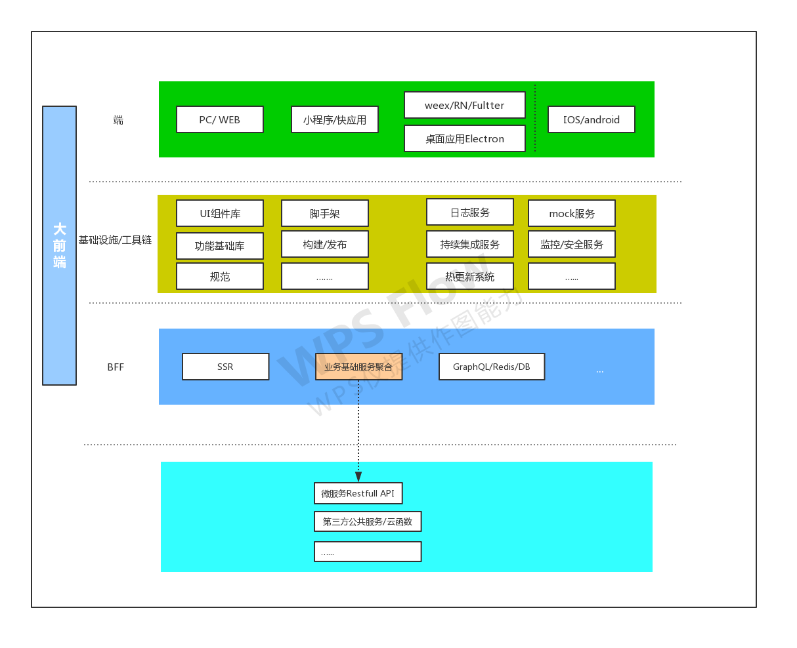

title: Nodejs
speaker: zhangaifei
css:
  - ./css/zoom.css
js:
  - ./js/jquery-1.11.0.min.js
  - ./js/init.js
plugins:
    - echarts
    - mermaid: {theme: forest}
prismTheme: twilight


<slide class="bg-black-blue aligncenter" image="./nodejs.png .dark">

# Nodejs 十年

大前端架构中中流砥柱-nodejs {.text-subtitle}

<br>

By zhangaifei {.text-intro}

<slide class="bg-black-blue aligncenter">

!

<slide class="bg-black-blue aligncenter">
# 前端开发的变革历程

> 前端工程化、体系化、职业化，泛化。

<slide class="bg-black-blue  aligncenter" image="./code.png .dark">
## 回顾发展历程


<slide class="bg-black-blue slide-top" image="./shenao.jpeg .dark">

###  冷兵器时代
- 2000年左右，web页面展示简单的静态图文信息，那个时候还没有FE(前端)，通常是一个叫美工的兼职。
- javascript脚本做的做多的事情可能就是表单提交。
- 2001年，盛大出了一款非常非常火爆的游戏叫《传奇》。
- 同一年北京申奥成功。
{.build.moveIn}

<slide class="bg-black-blue slide-center">

### 蒸汽时代
- 大概在2005年 AJAX 大火，你的网站没有局部更新太low了，不用刷新页面 就能更新UI 、数据 简直太神奇，时至今日，这项技术仍然是前端重要的基石之一。
- 2006年jQuery诞生， 开始了它10多年的光辉之路。
- 2008年Ryan Dahl发布 nodejs。 埋下了时势英雄的伏笔。
- 移动时代到来
{.build.moveIn}

!

<slide class="bg-black-blue slide-center">

### 电气时代
- 这个时期，seajs、requirejs前端模块化开始出现，终于有了简单包管理工具bower。
- grunt构建工具受捧，不久就被后来居上的gulp干到在地。
- 前端UI框架 Angular.js、Bankbone.js 大火，很多其他领域的模式或者解决方案被带到前端。
- Nodejs开始被逐步应用到企业级应用中。
{.build.moveIn}

<slide class="bg-black-blue slide-top">

### 信息时代
- 2014年，互联网+的概念大行其道。
- React、Vue等前端UI框架迅速爆红，数据驱动、前后端分离等理念得到越来越多青睐。
- 小程序、跨平台方案层出不穷。
- Nodejs应用越来越广泛：BFF层、微服务、serverless...
{.build.moveIn}

<!-- 能干啥 -->
<slide class="bg-black-blue slide-top">

### 前端发展进程中 干了啥
1. 提供了基于npm的依赖包管理机制
2. 各种构建工具grunt、gulp、webpack、rollup... 都是依赖nodejs实现
3. 各种编译预处理工具：babel、sass、less、图片压缩处理...
4. 各种web framework：express.js、koa、Hapi、egg.js 等
5. BF层服务、SSR 、同构应用、serverless...
6. ...
{.build.moveIn}

<br>
> 推动了整个前端技术发展，渗透到前端各个环节当中。 甚至还推动了其他技术的发展
{.build.fadeIn}
<slide class="bg-black-blue ">

## Nodejs 是什么？

> Node.js® 是一个基于 [Chrome V8 引擎](https://v8.dev/) 的 JavaScript 运行时。

:::flexblock {.features}

### 单线程
----
### 事件驱动 异步I/O
:::

> 在浏览器中的javascript控制网页，nodejs中的javascript控制计算机。


<!-- 优势 -->
<slide class="bg-black-blue aligncenter">

## nodejs的优势

<slide class="bg-black-blue slide-top">
### 简单
 javascript作为脚本语言，学习成本较低；nodejs采用单线程实现，不需要考虑传统多线程语言中线程编程锁的问题。
  
  创建一个web服务，只需要简单的三步：

  - 安装[nodejs](nodejs.cn)

  - index.js
  ```
  var http = require('http');

  const server = http.createServer((req, res) => {
    res.end('hello nodejs');
  });

  server.listen(3000, function () {
    console.log('node server has started at port:3000')
  })
  ```
  - 启动服务
  node index.js

<slide class="bg-black-blue aligncenter">

### 异步I/O, 高并发

  异步I/O 是通过[libuv](https://libuv.org/) 实现的，<br>
  而libuv内部是采用epoll机制并做增强。支持高并发的nginx 也是基于epoll实现的事件驱动。<br>
  从侧面也能说明nodejs的支持高并发特性原因


<!-- 和传统的多线程开发对比 -->
<slide class="bg-black-blue slide-top ">

### nodejs和传统的多线程编程对比

:::flexblock {.clients}
!
---
!
:::

<!-- 缺点 -->
<slide class="bg-black-blue slide-top ">

### nodejs的缺点

1. 不适用于计算密集型的业务场景
2. 发布时间较短，没有传统后端开发语言成熟：体现在具体场景的解决方案和基础库上。
3. 因为语言本身的无类型等特点，在编写大型应用程序时候，不如java等强类型语言更加安全、方便、可维护(Tepyscript、Flow等解决方案)
4. ...
{.build.moveIn}


<!-- 几个当前比较流行的词 -->
<slide class="bg-black-blue slide-top ">

### 讨论几个比较通用的应用场景
1. SSR
2. 同构应用
3. BFF
4. Serverless
{.build.moveIn}

<!-- 当前在我们业务中落地情况 -->
<slide class="bg-black-blue slide-top ">

### 当前nodejs在我们业务中的落地使用场景
1. 运营活动搭建系统
2. 前端脚手架、host等小工具
3. 前端发布系统 静态文件上传CDN 接口服务
4. 我爱卡m站 SSR 
5. 更多进行中...
{.build.moveIn}


